# ⬡ NexusSwarm v2 — Project Context Handbook

Welcome to the **NexusSwarm v2** technical handbook. This document serves as a persistent repository of architectural decisions, file hierarchies, API endpoints, model routing, database schemas, and operational guides for the project. Use this file as your primary context when developing, debugging, or deploying the system.

---

## 🗺️ System Architecture (v2)

NexusSwarm v2 introduces a layered architecture separating concerns into distinct engines while maintaining the hierarchical agent governance model. The system is designed around a **GitHub-centric workflow** where agents collaborate to transform issues into pull requests.

```mermaid
graph TD
    A[Web Dashboard] --> B[API Gateway]
    B --> C[Swarm Orchestrator Core]
    C --> D[Task Engine]
    C --> E[Memory Engine]
    C --> F[Model Router]
    D --> G[Agent Layer]
    E --> G
    F --> G
    G --> H[Tool Execution Layer]
    H --> I[External Models]
    
    subgraph "Web Dashboard"
        A1[Projects] --> A2[Agents] --> A3[Tasks] --> A4[Metrics]
    end
    
    subgraph "Agent Layer"
        G1[Architect Agent] --> G2[Coder Agent] --> G3[Reviewer Agent] --> G4[Tester Agent] --> G5[Security Agent] --> G6[DevOps Agent] --> G7[Documentation Agent]
    end
    
    subgraph "Tool Execution Layer"
        H1[GitHub] --> H2[Terminal Sandbox] --> H3[Docker] --> H4[File System] --> H5[Browser Tools] --> H6[CI/CD]
    end
    
    subgraph "External Models"
        I1[Ollama] --> I2[OpenAI] --> I3[Anthropic] --> I4[Gemini] --> I5[NVIDIA NIM]
    end
    
    classDef dashboard fill:#1e3a8a,stroke:#1e40af,color:#fff;
    classDef gateway fill:#3b82f6,stroke:#2563eb,color:#fff;
    classDef orchestrator fill:#6366f1,stroke:#4f46e5,color:#fff;
    classDef engine fill:#8b5cf6,stroke:#7c3aed,color:#fff;
    classDef agent fill:#10b981,stroke:#059669,color:#fff;
    classDef tool fill:#f59e0b,stroke:#d97706,color:#fff;
    classDef model fill:#ec4899,stroke:#db2777,color:#fff;
    
    class A dashboard;
    class B gateway;
    class C orchestrator;
    class D,E,F engine;
    class G agent;
    class H tool;
    class I model;
```



### Core Components

#### 1. Swarm Orchestrator Core (Brain)
Responsible for:
- **Task Decomposition**: Breaking user requests into actionable subtasks
- **Agent Assignment**: Matching tasks to appropriate specialist agents
- **Conflict Resolution**: Managing disagreements between agents
- **Progress Tracking**: Monitoring workflow execution and bottlenecks
- **Cost Management**: Optimizing LLM usage and resource allocation
- **Agent Communication**: Facilitating message passing between components

#### 2. Memory Engine (Your Moat)
Long-term memory system that stores and retrieves:
- Architecture decisions and patterns
- Past conversations and issue resolutions
- Pull request history and code review feedback
- Coding standards and team preferences
- Learned best practices and anti-patterns

*Implementation*: PostgreSQL with pgvector for semantic search, planned migration to Neo4j for graph relationships.

#### 3. Model Router (Intelligent Selection)
Dynamic model selection based on task metadata rather than static assignment:
- **Model Metadata**: Stores strengths, latency, cost, context window for each model
- **Task Analysis**: Analyzes incoming requests to determine optimal model characteristics
- **Performance Tracking**: Monitors success rates, hallucination rates, and user feedback
- **Continuous Learning**: Improves selection over time based on outcomes

*Model Categories*:
- **Coding Models**: Qwen Coder, DeepSeek Coder variants (code generation, refactoring, bug fixing)
- **Reasoning Models**: Llama 3, Nemotron (architecture, planning, task decomposition)
- **Lightweight Models**: Gemma, Mistral (summaries, documentation, classification)
- **Security/Validation Models**: Specialized models for vulnerability review, hallucination detection

#### 4. Agent Layer
Specialist workers with clearly defined responsibilities:

| Agent | Responsibilities | Output |
|-------|------------------|---------|
| **Architect Agent** | System design, architecture docs, task plans | Architecture diagrams, API specs, database schemas |
| **Coder Agent** | Code generation, refactoring, bug fixing | Pull requests, code commits, patches |
| **Reviewer Agent** | Code review, style checks, logic checks | Review comments, approval requests, change suggestions |
| **Tester Agent** | Unit/integration tests, coverage reports | Test suites, test results, coverage metrics |
| **Security Agent** | Dependency scanning, secret detection, prompt injection | Security reports, vulnerability assessments, fix recommendations |
| **DevOps Agent** | Dockerfiles, CI/CD configuration, deployment | Deployment configs, CI/CD pipelines, infrastructure as code |
| **Documentation Agent** | API docs, user guides, architecture decisions | Documentation files, changelogs, knowledge base entries |

#### 5. Tool Execution Layer
Integration with development and deployment tools:
- **GitHub**: Issue/PR management, code reviews, project boards
- **Terminal Sandbox**: Isolated command execution, build/test environments
- **Docker**: Containerization, image building, registry interactions
- **File System**: Workspace management, temporary files, artifacts
- **Browser Tools**: Automated testing, web scraping, documentation generation
- **CI/CD**: Pipeline execution, deployment automation, release management

#### 6. External Models
Access to multiple LLM providers for flexibility and optimization:
- Ollama (local/open models: Gemma, Qwen, etc.)
- OpenAI (GPT-4, GPT-3.5 families)
- Anthropic (Claude 3 family)
- Gemini (Google's latest models)
- NVIDIA NIM (optimized enterprise models)

---

## 📦 Project Structure

```
nexusswarm/
├── backend/                       # Fast API + Agent Swarm Logic
│   ├── agents/                    # Individual agent implementations
│   │   ├── architect.py
│   │   ├── coder.py
│   │   ├── reviewer.py
│   │   ├── tester.py
│   │   ├── security.py
│   │   ├── devops.py
│   │   └── documentation.py
│   ├── engines/                   # Core orchestration engines
│   │   ├── task_engine.py         # Task decomposition and assignment
│   │   ├── memory_engine.py       # Long-term memory storage and retrieval
│   │   └── model_router.py        # Intelligent model selection
│   ├── memory/                    # Persistence clients (PostgreSQL, Redis, GCS)
│   │   ├── db_client.py
│   │   ├── file_storage.py
│   │   └── redis_client.py
│   ├── mcp_servers/               # Custom Model Context Protocol servers
│   │   ├── github_mcp.py          # GitHub integration
│   │   ├── file_system_mcp.py     # Sandboxed file operations
│   │   └── terminal_mcp.py        # Isolated command execution
│   ├── workspace/                 # Local directory for generated codes (gitignored)
│   ├── Dockerfile                 # Multi-stage image build config
│   ├── requirements.txt           # Lock file for Python dependencies
│   ├── main.py                    # Server startup + service connections
│   └── routes.py                  # API endpoints, JSON responses & WebSockets
├── deploy/                        # Cloud Infrastructure automation
│   ├── setup.sh                   # GCP provisioning shell bootstrap script
│   └── cloudbuild.yaml            # Google Cloud Build automated pipeline configuration
├── frontend/                      # React Dashboard User Interface
│   ├── src/
│   │   ├── components/
│   │   │   ├── Dashboard/         # Projects, Agents, Tasks, Metrics views
│   │   │   ├── AgentPanel/        # Agent status and controls
│   │   │   ├── TaskPanel/         # Task submission and tracking
│   │   │   └── MetricsPanel/      # Performance analytics and costs
│   │   ├── App.tsx                # Application router and state management
│   │   └── ...
│   ├── Dockerfile                 # React SPA Node compilation config
│   ├── nginx.conf                 # SPA static assets & reverse proxy config
│   └── .env.production            # Cloud backend endpoint bindings
└── README.md                      # Introduction and quick start guide
```

---

## 🗄️ Database Schema & Storage Model

NexusSwarm v2 uses a hybrid architecture emphasizing the Memory Engine for long-term knowledge retention.

### 1. PostgreSQL Schema (Enhanced for Memory Engine)
The PostgreSQL database now emphasizes **semantic memory storage** alongside transactional states:

* **`tasks`**: Tracks user requests and workflow status
* **`pipelines`**: Execution progress metrics for each agent
* **`agent_logs`**: Immutable stream of all agent interactions (with embeddings for search)
* **`task_outputs`**: Generated artifacts linked to tasks
* **`memories`**: **NEW** - Long-term memory entries with vector embeddings
    - `id`: Unique identifier
    - `content`: The memory text (decision, conversation, etc.)
    - `embedding`: Vector representation for semantic search
    - `memory_type`: architecture | conversation | pr_review | coding_standard | etc.
    - `source_task_id`: Originating task (if applicable)
    - `confidence_score`: Quality/reliability metric
    - `access_count`: Usage frequency for caching
    - `created_at`, `updated_at`: Timestamps
* **`model_performance`**: **NEW** - Tracks LLM effectiveness for intelligent routing
    - `model_name`: Identifier for the LLM
    - `task_type`: Category of task (coding, reasoning, etc.)
    - `success_rate`: Percentage of successful outcomes
    - `avg_latency`: Average response time
    - `hallucination_rate`: Frequency of inaccurate outputs
    - `cost_per_token`: Estimated usage cost
    - `last_updated`: Timestamp for freshness

### 2. GCS and Workspace File Storage
Unchanged from v1 but now integrated through the **File System MCP Server**:
- Agent outputs stored locally under `workspace/{task_id}/{filename}`
- Concurrent upload to Google Cloud Storage (`gs://{gcs_bucket}/{task_id}/{filename}`)
- Multi-replica consistency for Cloud Run environments
- Graceful fallback to local disk when GCS unavailable

---

## 🧬 Intelligent Model Router (`backend/engines/model_router.py`)

Replaces static agent-model mapping with dynamic selection based on task analysis and model metadata:

```python
# Model Metadata Example
MODEL_REGISTRY = {
    "qwen/qwen3-coder-480b-a35b-instruct": {
        "strengths": ["coding", "debugging", "refactoring"],
        "task_types": ["code_generation", "bug_fix", "refactoring"],
        "latency_ms": 1200,
        "cost_per_1k_tokens": 0.0,  # NVIDIA NIM free tier
        "context_window": 128000,
        "provider": "nvidia_nim"
    },
    "meta/llama-3.3-70b-instruct": {
        "strengths": ["reasoning", "planning", "analysis"],
        "task_types": ["architecture", "task_decomposition", "planning"],
        "latency_ms": 1800,
        "cost_per_1k_tokens": 0.0,
        "context_window": 128000,
        "provider": "nvidia_nim"
    },
    # ... other models
}

async def select_optimal_model(task_type: str, requirements: Dict) -> str:
    """
    Intelligently select the best model for a given task type and requirements.
    """
    compatible_models = [
        (model_id, metadata) for model_id, metadata in MODEL_REGISTRY.items()
        if task_type in metadata["task_types"]
    ]
    filtered_models = apply_requirements(compatible_models, requirements)
    scored_models = [
        (model_id, calculate_model_score(model_id, task_type))
        for model_id, _ in filtered_models
    ]
    return max(scored_models, key=lambda x: x[1])[0] if scored_models else DEFAULT_MODEL
```

---

## 🔌 API & Live WebSocket Protocol

### 1. REST Endpoints (`backend/routes.py`)
* `POST /submit-task`: Creates new task from GitHub issue or direct input
* `GET /task/{task_id}`: Retrieves full status including memory references
* `GET /memory/search`: Semantic search across long-term memory
* `GET /models/performance`: Returns model effectiveness metrics
* `GET /agents/status`: Real-time status of all 7 specialist agents
* `GET /dashboard/metrics`: Aggregated metrics for Web Dashboard
* `POST /webhook/github`: Receives GitHub issue/PR events to trigger workflows

### 2. WebSocket Protocol (`ws://localhost:8000/ws/agents`)
Enhanced message structure for v2:

```json
{
  "type": "agent_update|memory_update|model_update|workflow_progress",
  "task_id": "uuid",
  "agent": "CoderAgent",
  "status": "working|waiting_for_memory|model_loading|etc.",
  "message": "Generating FastAPI controller for user authentication...",
  "output": "",
  "model": "qwen/qwen3-coder-480b-a35b-instruct",
  "level": "worker",
  "pipeline": "engineering",
  "memory_referenced": ["mem_123", "mem_456"],
  "model_selection_reason": "Selected for coding task with low latency requirement",
  "ts": "2026-06-17T15:37:41Z"
}
```

---

## 💻 Frontend Web Dashboard

The v2 frontend provides role-based views for different stakeholders:

### 1. Projects View
- List of connected GitHub repositories
- Project health metrics (open issues, PR velocity, code quality)
- Quick creation of new projects/swarms

### 2. Agents View
- Real-time status of all 7 agent types across active projects
- Individual agent performance metrics
- Manual override controls for agent behavior
- Agent-to-agent communication logs

### 3. Tasks View
- Kanban board of active, queued, and completed tasks
- Task details including assigned agents, progress, and memory usage
- Ability to prioritize, block, or restart tasks
- Linked PRs/issues and generated artifacts

### 4. Metrics View
- **Model Performance**: Success rates, latency, cost trends
- **Workflow Efficiency**: Average completion times, bottleneck identification
- **Quality Gates**: Test coverage, security scan results, review approval rates
- **Resource Utilization**: Token consumption, compute costs, concurrent workflows
- **Memory Engine Stats**: Memories stored, accessed, and their impact on quality

---

## 🚀 MVP Approach & GitHub-Centric Workflow

### Phase 1: Core Trio (MVP)
1. **GitHub Issue Created** → Triggers Nexus Swarm activation
2. **Architect Agent**: Creates technical specification from issue description
3. **Coder Agent**: Generates implementation pull request
4. **Reviewer Agent**: Provides automated code review feedback
5. **Output**: GitHub Pull Request ready for human review

### Phase 2: Extended Collaboration
- Add **Tester Agent** for automated test generation and execution
- Add **Security Agent** for vulnerability scanning
- Add **DevOps Agent** for deployment preparation
- Add **Documentation Agent** for API/user guide updates

---

## 🛠️ Verification & Local Development

To verify code changes locally:

1. **Backend Logic & Engine Testing**:
   ```bash
   cd backend
   .venv\Scripts\python -m pytest engines/ -v
   .venv\Scripts\python -m pytest agents/ -v
   ```

2. **Frontend Type Sanity**:
   ```bash
   cd frontend
   npm run build
   npm run type-check
   ```