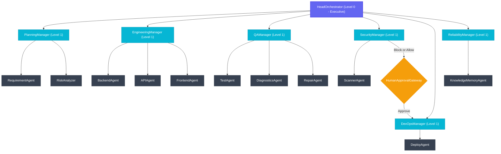

# ⬡ NexusSwarm — Project Context Handbook

Welcome to the **NexusSwarm** technical handbook. This document serves as a persistent repository of architectural decisions, file hierarchies, API endpoints, model routing, database schemas, and operational guides for the project. Use this file as your primary context when developing, debugging, or deploying the system.

---

## 🗺️ System Architecture & Agent Hierarchy

NexusSwarm is structured as a multi-tier governance hierarchy. Unlike flat or peer-to-peer agent layouts, operations are organized into an executive level, pipeline managers, and specialist workers. Custom stdio Model Context Protocol (MCP) servers and routes enforce quality and security boundaries at each tier.



### Governance Flow
1. **HeadOrchestrator** decomposes a user request into a JSON execution plan.
2. **PlanningManager** coordinates extraction of requirements (`requirements.md`) and technical risks (`risk_analysis.md`).
3. **EngineeringManager** generates backend endpoints (`backend.py`), OpenAPI specification (`openapi.yaml`), and frontend screens (`components.tsx`).
4. **QAManager** initiates `TestAgent` to generate `test_backend.py`. It runs the test suite, detects errors (e.g. missing dependencies), launches a repair loop via `DiagnosticsAgent` + `RepairAgent` to patch `requirements.txt`, and validates compliance.
5. **SecurityManager** uses the `ScannerAgent` to perform vulnerability scans. If **CRITICAL** issues (e.g., hardcoded credentials) are found, the pipeline status is set to `blocked`.
6. **HumanApprovalGateway** simulates an engineering gate.
7. **DevOpsManager** deploys container architectures, **but only if Security has cleared the gates and approval is signed off.**
8. **ReliabilityManager** runs diagnostics and logs lessons to long-term memory (`knowledge.md`).

---

## 📦 Project Structure

```
nexusswarm/
├── backend/                       # Fast API + Agent Swarm Logic
│   ├── agents/
│   │   ├── llm_factory.py         # NVIDIA NIM API endpoints mapping
│   │   └── ...                    # Individual agent logic classes
│   ├── db/
│   │   └── init.sql               # PostgreSQL tables and index schemas
│   ├── memory/
│   │   ├── db_client.py           # SQL Alchemy task, log, and conflict CRUD
│   │   └── file_storage.py        # Parallel saving on Local Disk & AWS S3
│   ├── workspace/                 # Local directory for generated codes (gitignored)
│   ├── Dockerfile                 # Multi-stage image build config
│   ├── requirements.txt           # Lock file for Python dependencies
│   ├── main.py                    # Server startup + S3 connection checks
│   └── routes.py                  # API endpoints, JSON responses & WebSockets
├── deploy/                        # Cloud Infrastructure automation
│   ├── setup_aws.sh               # AWS provisioning shell bootstrap script
│   └── deploy_aws.sh              # AWS deployment App Runner script
├── frontend/                      # React IDE User Interface
│   ├── src/
│   │   ├── components/
│   │   │   └── IDE/               # Activity bar, file browser, editor tabs, terminal panels
│   │   │       ├── ActivityBar.tsx
│   │   │       ├── AgentTreePanel.tsx
│   │   │       ├── EditorArea.tsx
│   │   │       └── IDETerminalPanel.tsx
│   │   ├── App.tsx                # Context sharing routes
│   │   └── ...
│   ├── Dockerfile                 # React SPA Node compilation config
│   ├── nginx.conf                 # SPA static assets & reverse proxy config
│   └── .env.production            # Cloud backend endpoint bindings
└── README.md                      # General introduction
```

---

## 🗄️ Database Schema & Storage Model

NexusSwarm uses a hybrid architecture of transactional databases for states/logs and blob storage for generated source codes.

### 1. PostgreSQL Schema (`backend/db/init.sql`)
The PostgreSQL database persists the audit logs, execution metrics, and generated artifacts:
* **`tasks`**: Tracks global user prompt status (`pending | planning | engineering | qa | security | devops | complete | failed`).
* **`pipelines`**: Stores progress metrics (0-100%) and states (`idle | active | blocked | done | failed`) for the 6 core stages.
* **`agent_logs`**: Write-once immutable stream of every prompt request, model token count, and internal response.
* **`task_outputs`**: Links final structured text generated by agents to tasks.
* **`conflicts`**: Log of raised blocks resolved by the Head Orchestrator or escalated to human operator.

### 2. S3 and Workspace File Storage (`backend/memory/file_storage.py`)
Agent outputs (like `.py` code, `.yaml` specs, `.tsx` components) are written locally under `workspace/{task_id}/{filename}` and uploaded concurrently to Amazon S3 (`s3://{s3_bucket}/{task_id}/{filename}`) via `boto3`.
* **Multi-replica Consistency**: App Runner container environments list and retrieve code files directly from S3.
* **Graceful Fallbacks**: If S3 is unavailable or credentials are not configured, the storage manager falls back to serving files from the local container disk workspace folder.

---

## 🧬 NVIDIA NIM Model Mappings (`backend/agents/llm_factory.py`)

All agents communicate using the OpenAI-compatible **NVIDIA NIM** API endpoints. To ensure fast response times and avoid rate limits on the free-tier API, mappings are optimized to use two verified models:

| Agent Tier | Primary Role | NIM Model ID |
|------------|--------------|--------------|
| **Executive & Security** | Orchestration, Security scans, and Gate approvals | `meta/llama-3.3-70b-instruct` |
| **Engineering Workers** | Code, tests, and configurations generation | `meta/llama-3.3-70b-instruct` |
| **Pipeline Managers** | Coordination, status routing, and progress loops | `meta/llama-3.1-8b-instruct` |
| **Utility Workers** | Extraction, summarization, and diagnostics | `meta/llama-3.1-8b-instruct` |

### Key Settings
* **Base URL**: `https://integrate.api.nvidia.com/v1`
* **Credentials**: Bound to the `NVIDIA_API_KEY` environment variable.

---

## 🔌 API & Live WebSocket Protocol

The backend and frontend communicate via REST endpoints for static operations and a persistent WebSocket stream for live UI state updates.

### 1. REST Endpoints (`backend/routes.py`)
* `POST /submit-task`: Starts the background task process and returns a `task_id`.
* `GET /task/{task_id}`: Retrieves full status, inputs, outputs, and pipeline progress from DB/Memory.
* `GET /files/{task_id}`: Lists files browser tree.
* `GET /files/{task_id}/{filename}`: Retrieves raw file code for display in Monaco editor.
* `GET /files/{task_id}/download`: Zips files on-the-fly and streams the attachment download.
* `GET /health`: Safe service readiness check.

### 2. WebSocket Protocol (`ws://localhost:8000/ws/agents`)
Pushes real-time JSON frames to keep the frontend responsive:
```json
{
  "type": "agent_update",
  "task_id": "uuid",
  "agent": "BackendAgent",
  "status": "working",
  "message": "Generating FastAPI controllers...",
  "output": "",
  "model": "meta/llama-3.3-70b-instruct",
  "level": "worker",
  "pipeline": "engineering",
  "ts": "2026-05-27T15:37:41Z"
}
```

---

## 💻 Frontend IDE Design System

The frontend replicates a modern dark-themed Integrated Development Environment (IDE):
* **ActivityBar**: Side tab selector (`Agent Graph`, `Files Explorer`, `Task History`).
* **AgentTreePanel**: Live file list from `/files/{task_id}` with download ZIP trigger.
* **EditorArea**: Monaco-powered code viewer displaying selected workspace file.
* **IDETerminalPanel**: Live scrolling logs from the active WebSocket. Includes a **💻 Open Cloud Shell** integration pointing directly to the AWS CloudShell console to execute scripts or manage EC2/App Runner instances.
* **Share Links**: Task IDs are synced to browser URL query strings (`/?task=id`). Opening a shared link retrieves the entire agent state history from the database, making workspaces shareable.

---

## 🚀 Bootstrap & AWS Deployment

Deployment is fully automated using AWS native tools:

### 1. Provisioning Bootstrap (`deploy/setup_aws.sh`)
Automates creation of AWS resources:
- Creates ECR repositories for both backend and frontend.
- Creates S3 Bucket for persistent files mapping.
- Provisions a db.t4g.micro PostgreSQL RDS instance.
- Creates AWS Secrets Manager secrets (`nexusswarm/nvidia-key`, `nexusswarm/db-pass`).
- Configures IAM App Runner service and execution roles.

### 2. Automated Pipeline (`deploy/deploy_aws.sh`)
Deployment handles continuous delivery:
- Pulls ECR registry auth credentials.
- Builds and pushes Backend Docker image.
- Deploys/Updates Backend on AWS App Runner, injecting RDS connections and Secret Manager keys.
- Fetches Backend endpoint, injects it into Frontend build args, compiles frontend image, pushes, and updates Frontend on AWS App Runner.

---

## 🛠️ Verification & local testing
To verify code changes locally, run the following procedures:
1. **Pytest Run**: Check backend logic and S3 local fallbacks:
   ```bash
   cd backend
   .venv\Scripts\python -m pytest
   ```
2. **Build Test**: Verify typescript compiler and bundler sanity:
   ```bash
   cd frontend
   npm run build
   ```
