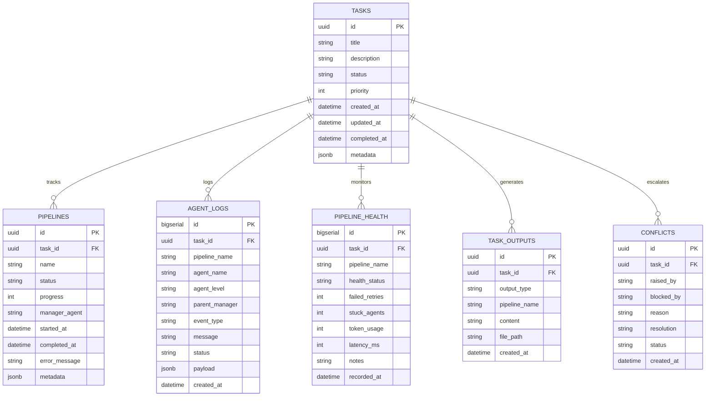

# NexusSwarm v2 — Database Schema & Models Layout

This document details the database storage engine, Entity-Relationship mappings, SQL schemas, and JSON payloads used by **NexusSwarm v2**.

---

## 1. Storage & Database Engines

NexusSwarm implements database-engine parity for seamless developer experience:
- **Local Development**: Configured to run against a self-contained SQLite database file at `backend/db/reports.sqlite3`. Columns representing complex structures store plain JSON text.
- **Production Layer**: Configured to run against a PostgreSQL 15 relational store on Google Cloud SQL. Utilizes native `JSONB` columns for fast parsing, indexing, and JSON-path queries.
- **Memory Engine Vectors**: Integrates with PostgreSQL `pgvector` extension for storing and querying 1024-dimensional semantic embeddings (using `nvidia/embed-qa-4` model) for long-term agent memory.

---

## 2. Entity-Relationship Diagram (ERD)

---

## 3. Core Database Tables

For SQLAlchemy model definitions, see [db_client.py](file:///c:/hack/backend/memory/db_client.py).

### 3.1. `tasks`
Tracks top-level user task submissions (e.g. "Build a REST API").
- **Columns**: `id` (UUID, PK), `title` (TEXT), `description` (TEXT), `status` (TEXT: pending | planning | engineering | qa | security | devops | complete | failed), `priority` (INT), `created_at` (TIMESTAMPTZ), `updated_at` (TIMESTAMPTZ), `completed_at` (TIMESTAMPTZ), `metadata` (JSONB).

### 3.2. `pipelines`
Tracks the status and progress of individual pipeline phases for each task.
- **Columns**: `id` (UUID, PK), `task_id` (UUID, FK), `name` (TEXT: planning | engineering | qa | security | devops), `status` (TEXT: idle | active | blocked | done | failed), `progress` (INT), `manager_agent` (TEXT), `started_at` (TIMESTAMPTZ), `completed_at` (TIMESTAMPTZ), `error_message` (TEXT), `metadata` (JSONB).

### 3.3. `agent_logs`
Full immutable audit trail of every agent action and event during swarm runs.
- **Columns**: `id` (BIGSERIAL, PK), `task_id` (UUID, FK), `pipeline_name` (TEXT), `agent_name` (TEXT), `agent_level` (TEXT: orchestrator | manager | worker), `parent_manager` (TEXT), `event_type` (TEXT: agent_action | pipeline_update | conflict | escalation | complete | error), `message` (TEXT), `status` (TEXT: in_progress | done | error | blocked), `payload` (JSONB), `created_at` (TIMESTAMPTZ).

### 3.4. `pipeline_health`
Snapshot of pipeline operational metrics, updated continuously by the Orchestrator.
- **Columns**: `id` (BIGSERIAL, PK), `task_id` (UUID, FK), `pipeline_name` (TEXT), `health_status` (TEXT: healthy | warning | critical), `failed_retries` (INT), `stuck_agents` (INT), `token_usage` (INT), `latency_ms` (INT), `notes` (TEXT), `recorded_at` (TIMESTAMPTZ).

### 3.5. `task_outputs`
Final artifacts generated per task (code files, test results, security audit reports).
- **Columns**: `id` (UUID, PK), `task_id` (UUID, FK), `output_type` (TEXT: code | test_results | security_report | deployment_config | summary), `pipeline_name` (TEXT), `content` (TEXT), `file_path` (TEXT), `created_at` (TIMESTAMPTZ).

### 3.6. `conflicts`
Tracks disputes and blocks escalated to the Head Orchestrator for resolution.
- **Columns**: `id` (UUID, PK), `task_id` (UUID, FK), `raised_by` (TEXT), `blocked_by` (TEXT), `reason` (TEXT), `resolution` (TEXT), `status` (TEXT: open | resolved | escalated_to_human), `created_at` (TIMESTAMPTZ).
