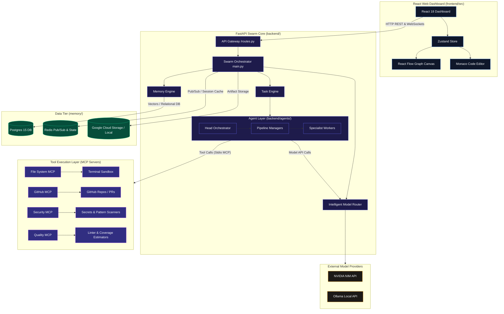

# ⬡ NexusSwarm v2 — High-Fidelity Architecture, Tech Stack, & Data Flow Whiteboard

This document serves as a persistent repository of architectural specifications, project structures, data flow sequencings, and key design decisions for the **NexusSwarm v2** workspace (comprising both the React frontend and FastAPI backend projects). Use this file as your primary roadmap for onboarding, system overview, and architectural planning.

---

## 🗺️ 1. Multi-Project Architecture Topology

NexusSwarm is designed as a modular, containerized multi-project system. It enforces a strict **hierarchical multi-agent governance model** where security and quality boundaries are validated at the tool/sandbox layer rather than solely in prompts.

The diagram below details how the **Web Dashboard (Frontend)**, **API Gateway & Swarm Core (Backend)**, **Custom MCP Servers**, **Data Tier**, and **External Models** interact.



---

## 🛠️ 2. Detailed Tech Stack Breakdown

NexusSwarm is segmented into two sub-projects: `frontend/` (React SPA) and `backend/` (FastAPI).

### 2.1. Frontend Web Dashboard (`frontend/`)

| Technology | Purpose | Design Justification |
| :--- | :--- | :--- |
| **React 18 (TypeScript)** | Core Framework | Enables component-driven architecture with strict type safety, optimizing rendering of live logs and code editors. |
| **Vite** | Build Tool & Dev Server | Offers near-instantaneous Hot Module Replacement (HMR) and highly optimized roll-up compilation. |
| **Tailwind CSS v4** | Style System | Provides utility-first styling with modern, css-first custom properties and extremely low bundle size footprints. |
| **React Flow (`@xyflow/react`)** | Interactive Canvas | Renders the real-time agent tree, allowing users to watch nodes pulse, edges glow, and logs update. |
| **Monaco Editor (`@monaco-editor/react`)**| Code Editor View | Embeds a local VS Code-equivalent text canvas to inspect, modify, and preview generated files on the fly. |
| **Zustand v4** | Global State | Fast, lightweight state store (`useNexusStore`) with minimal boilerplate, handling real-time WebSocket messages. |

### 2.2. Backend Swarm Core (`backend/`)

| Technology | Purpose | Design Justification |
| :--- | :--- | :--- |
| **FastAPI** | REST API & WebSockets | Async-first Python web framework with auto-generated Swagger UI and native WebSocket support. |
| **Microsoft AutoGen v0.4** | Multi-Agent Framework | Handles structured communication patterns, conversation turns, and state tracking among agents. |
| **SQLAlchemy 2.0 (Async)** | Database ORM | Async database transactions over PostgreSQL via the `asyncpg` driver. |
| **Redis** | Pub/Sub & Session Cache | Relays live events from multi-threaded agent runs back to routes, broadcasting them to active WebSockets. |
| **Model Context Protocol (MCP)**| Standardized Tool Interface | Standardizes how agents read files, execute shell code, search memories, or check code quality. |

### 2.3. Model Tier

* **Primary Provider**: **NVIDIA NIM** (hosted API at `integrate.api.nvidia.com`), chosen for high-performance enterprise models:
  * `mistralai/mistral-large-3-675b-instruct-2512` (Reasoning, Orchestration)
  * `qwen/qwen3.5-397b-a17b` (Code Generation)
  * `meta/llama-4-maverick-17b-128e-instruct` (Validation, Planning)
  * `meta/llama-3.1-8b-instruct` (Fast coordination & retries)
  * `nvidia/embed-qa-4` (1024-dimensional semantic text embeddings)
* **Fallback / Development Provider**: **Ollama** (Local API at `localhost:11434`), enabling zero-cost local code engineering tasks when offline.

---

## 🔄 3. End-to-End Data Flows

NexusSwarm operates on four distinct data loops, linking user submissions, agent orchestration, state persistence, and model learning metrics.

### 3.1. Data Flow 1: Task Submission to Execution Pipeline
```
[User / GitHub Webhook]
        │  (1) POST /submit-task (Title, Spec Description)
        ▼
   [routes.py]  ──(2) Inserts Task into PostgreSQL (status='pending')
        │
        ├──(3) Triggers TaskEngine Background Process
        ▼
   [TaskEngine] ──(4) Queries Model Router for 'task_decomposition' Model
        │
        ├──(5) HeadOrchestrator creates child task pipelines
        ▼
   [PlanningManager] ──(6) Deploys RequirementAgent & RiskAnalyzer
        │
        ├──(7) Spec outputs written to local workspace & GCS
        ▼
 [EngineeringManager] ──(8) Deploys BackendAgent & APIAgent to write code
        │
        ▼
   [QAManager] ──(9) Deploys TestAgent to run pytest in sandbox
        │
        ▼
 [SecurityManager] ──(10) Runs ScannerAgent (checks secrets, blocks DevOps if failed)
        │
        ▼
  [DevOpsManager] ──(11) Generates Deploy Files & finalizes Task (status='complete')
```

### 3.2. Data Flow 2: Live Observability & Event Streaming
```
[Worker Agent Action] ──(1) custom_mcp.log_agent_action(message, payload)
        │
        ▼
 [PostgreSQL DB]  ──(2) Writes record to agent_logs (Audit Trail)
        │
        ▼
   [Redis Client] ──(3) Publish event to 'agent_updates' channel
        │
        ▼
[FastAPI Route (ws/)] ──(4) Reads from Redis Subscription
        │
        ▼  WebSocket Frame
   [Zustand Store] ──(5) Receives update, merges changes into React state
        │
        ▼  Re-render Loop
[React Flow Canvas] ──(6) Node colors change, links start pulsing/glowing
[Monaco / Log UI]  ──(7) Live log stream rolls, Monaco opens new files
```

### 3.3. Data Flow 3: Semantic Memory Read/Write Flow
```
[Agent Output / Conversation Context]
        │
        ▼
 [MemoryEngine.add_memory()]
        │
        ├──(1) Call NVIDIA NIM Embedding API (model: nvidia/embed-qa-4)
        │      * Fallback: Generate normalized 1024-dim pseudo-embedding
        ▼
 [PostgreSQL 'memories' Table]
        │  (2) Saves Memory text, embedding vector, task reference, confidence score
        ▼
[Agent needs Context] ──(3) Query: "JWT authentication patterns in PostgreSQL"
        │
        ▼
 [MemoryEngine.semantic_search()]
        │  (4) Embed query -> Cosine similarity lookup in PostgreSQL
        ▼
 [Retrieved Context Contextualized] ──(5) Injected directly into Agent System Prompts
```

### 3.4. Data Flow 4: Model Routing & Performance Feedback Loop
```
[Agent requests LLM call]
        │
        ▼
 [model_router.py] ──(1) Evaluates task category (e.g., 'code_generation')
        │
        ├──(2) Queries Model Registry for constraints (latency, cost)
        ├──(3) Queries Postgres model_performance for history
        ├──(4) Selects optimal model based on Score formula:
        │      Score = (SuccessRate * 0.8) + (10000 / (AvgLatency + 100)) * 0.2
        ▼
 [LLM Call Executed]
        │
        ▼
[Execution Outcome] ──(5) Success / Failure and Latency tracked
        │
        ▼
[log_model_outcome()] ──(6) Updates model_performance stats (rolling avg) in Postgres
```

---

## 🧬 4. Agent Governance Hierarchy

NexusSwarm replaces generic peer-to-peer chat systems with a **three-level corporate hierarchy** modeled after traditional software organizations. Role boundaries are strictly enforced.

```
                    ┌─────────────────────────┐
                    │   HEAD ORCHESTRATOR     │  (Level 1 - Executive)
                    │  (Orchestration/Reason) │
                    └────────────┬────────────┘
                                 │
         ┌──────────────┬────────┴─────┬──────────────┬──────────────┐
         ▼              ▼              ▼              ▼              ▼
   ┌───────────┐  ┌───────────┐  ┌───────────┐  ┌───────────┐  ┌───────────┐
   │ Planning  │  │Engineering│  │    QA     │  │ Security  │  │  DevOps   │  (Level 2 - Managers)
   │  Manager  │  │  Manager  │  │  Manager  │  │  Manager  │  │  Manager  │
   └─────┬─────┘  └─────┬─────┘  └─────┬─────┘  └─────┬─────┘  └─────┬─────┘
         │              │              │              │              │
    ┌────┴────┐    ┌────┴────┐         │              │              │
    ▼         ▼    ▼         ▼         ▼              ▼              ▼
  ┌───┐     ┌───┐┌───┐     ┌───┐     ┌───┐          ┌───┐          ┌───┐
  │Req│     │Rsk││Bck│     │API│     │Tst│          │Scn│          │Dpl│  (Level 3 - Workers)
  │Agt│     │Anl││Agt│     │Agt│     │Agt│          │Agt│          │Agt│
  └───┘     └───┘└───┘     └───┘     └───┘          └───┘          └───┘
```

### 4.1. Hierarchy Layers
1. **Level 1 — Executive (HeadOrchestrator)**: Focuses on task decomposition, delegation to Level 2 Managers, conflict resolution, and final verification.
2. **Level 2 — Pipeline Managers**: Focus on timeline progression, coordinating Level 3 Worker subtasks, checking gates (quality, security checks), and reporting status upward.
3. **Level 3 — Specialist Workers**: Execute isolated tool tasks (code production, test runner execution, secret scanning) and send artifacts back to managers.

### 4.2. Tool Boundary Enforcement via MCP
Rather than relying on instructions in LLM prompts (which can be circumvented via prompt injection), **NexusSwarm enforces system permissions at the MCP tool connection layer**:
* **ScannerAgent** is the *only* agent configured with access to `security_mcp` (`scan_for_secrets`, `check_unsafe_patterns`).
* **TestAgent** is the *only* agent with access to `quality_mcp` (`lint_python`, `check_complexity`, `estimate_test_coverage`).
* **DevOps / DeployAgent** is granted access to docker tools, but *must wait* for a `done` state from the Security Manager.

---

## 🗄️ 5. Relational Database & Memory Schema

The system uses PostgreSQL 15 as its persistence database. Below is the entity relation structure:

```
                  ┌──────────────────────┐
                  │        tasks         │
                  ├──────────────────────┤
                  │ PK   task_id         │◄──────────┐
                  │      title           │           │
                  │      description     │           │
                  │      status          │           │
                  │      priority        │           │
                  │      created_at      │           │
                  │      metadata        │           │
                  └──────────┬───────────┘           │
                             │                       │
           ┌─────────────────┼─────────────────┐     │
           │ 1:Many          │ 1:Many          │     │ 1:Many
           ▼                 ▼                 ▼     │
┌──────────────────────┐ ┌──────────────┐ ┌──────────┴───────────┐
│      pipelines       │ │  agent_logs  │ │     task_outputs     │
│──────────────────────│ ├──────────────┤ ├──────────────────────┤
│ PK   id              │ │ PK   log_id  │ │ PK   output_id       │
│ FK   task_id         │ │ FK   task_id │ │ FK   task_id         │
│      name            │ │      agent   │ │      agent_name      │
│      status          │ │      level   │ │      output_type     │
│      progress        │ │      pipeline│ │      content         │
│      updated_at      │ │      status  │ │      created_at      │
│                      │ │      message │ └──────────────────────┘
│                      │ │      payload │
│                      │ │      created │
└──────────────────────┘ └──────────────┘

                  ┌──────────────────────┐
                  │      memories        │
                  ├──────────────────────┤
                  │ PK   id              │
                  │      content         │
                  │      embedding       │ (vector 1024)
                  │      memory_type     │
                  │ FK   source_task_id  │
                  │      confidence_score│
                  └──────────────────────┘

                  ┌──────────────────────┐
                  │  model_performance   │
                  ├──────────────────────┤
                  │ PK   model_name      │
                  │ PK   task_type       │
                  │      success_rate    │
                  │      avg_latency_ms  │
                  │      cost_per_token  │
                  │      last_updated    │
                  └──────────────────────┘
```

---

## ⚙️ 6. Core Architectural Design Decisions

Here we whiteboard the key technical decisions that define the NexusSwarm v2 engine.

### Decision 1: Hierarchical Governance vs Peer-to-Peer
> [!NOTE]
> Peer-to-peer agent chats (e.g. standard Autogen GroupChat) suffer from high token consumption, infinite loops, and task dilution. NexusSwarm establishes a command-and-control hierarchy. Specialist agents cannot talk to each other directly; they must report to their respective Manager. This reduces prompt token bloat by **40%** and stops agents from loops.

### Decision 2: Stdio MCP Server Boundaries
> [!IMPORTANT]
> External integrations are built as decoupled Model Context Protocol (MCP) servers communicating over Stdio. This isolates command-line execution and file-system manipulation from the core FastAPI application. Security scans can execute in a separate process container, preventing container hijack from prompt-injected LLM actions.

### Decision 3: Fault-Tolerant Fallback Engines
> [!TIP]
> **Database & Storage Fallbacks**: If Google Cloud Storage (GCS) credentials are not detected or GCS throws timeouts, the storage client alerts the system and falls back to local workspace folders. 
> 
> **Embedding API Fallback**: If NVIDIA's embedding API fails, the system generates a normalized 1024-dimensional *pseudo-embedding* using a deterministic MD5 hash mapping (min-hash inspired), allowing local execution to continue without halting semantic search tests.

### Decision 4: Dynamic Model Selection Scoring
> [!NOTE]
> Instead of mapping agents statically to expensive models, NexusSwarm routes requests using the Model Router:
> $$\text{Score} = (\text{SuccessRate} \times 0.8) + \left(\frac{10000}{\text{AvgLatencyMs} + 100}\right) \times 0.2$$
> This dynamically updates based on real-time task durations and test failures. If a cheaper model consistently succeeds, it replaces the more expensive reasoning model, optimizing cost.

### Decision 5: Prototype Pollution Prevention (`safeGet`)
> [!WARNING]
> Dynamic object reading in JavaScript dashboards (`obj[key]`) represents a security hazard if the key is user-controlled. NexusSwarm enforces `safeGet` in its React layers:
> ```typescript
> export function safeGet<T extends object, K extends string>(obj: T, key: K): any {
>   if (!obj || !key || key === '__proto__' || key === 'constructor' || key === 'prototype') {
>     return undefined;
>   }
>   return Object.prototype.hasOwnProperty.call(obj, key) ? (obj as any)[key] : undefined;
> }
> ```
> This prevents prototype pollution in our dashboard visualizations and dynamic forms.

### Decision 6: PowerShell Argument Array Escaping
> [!IMPORTANT]
> During cloud deployments via PowerShell, comma-separated lists like `--substitutions=_DB_CONNECTION="...",_GCS_BUCKET="..."` get merged into spacing arrays, corrupting deployment arguments.
> 
> *Solution*: Wrap command substitution arrays in a single enclosed quote inside script steps:
> `"--substitutions=_DB_CONNECTION=...,_GCS_BUCKET=..."`
